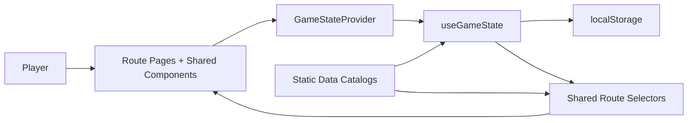

# Snooker Career Manager

Snooker Career Manager is a desktop-first single-page career-management game built with React, TypeScript, and Vite. The player controls one created snooker professional across training, tournaments, travel, equipment, staff, finances, sponsorship, recovery, rankings, and multi-season career progression.

This README is intentionally detailed. It is the main technical and gameplay reference for how the current build works, how the systems depend on each other, and where future development should land.

## 1. What The Project Is

The game is currently a client-only management sim with:

- one canonical local save
- one player-controlled career
- authored tournament and pathway data
- state-driven route pages
- season rollover and archive support
- a separate competition-table model for different circuits

There is no backend, no remote save service, and no multiplayer layer. All meaningful state lives in the browser and is persisted via `localStorage`.

The project is designed around a simple rule:

- authored content lives in data files
- mutable career truth lives in the state engine
- route pages render and dispatch actions
- shared selectors shape page-specific data

## 2. Product Loop

The core loop is:

1. Create a player and choose how the career starts.
2. Train, rest, recover, hire staff, and manage equipment.
3. Enter events, pay travel and preparation costs, and advance the calendar.
4. Simulate or play through live matches.
5. Earn ranking points, prize money, sponsorship value, and reputation.
6. Climb through youth, amateur, Q Tour, Q School, and professional pathways.
7. Roll into the next season with archive records and career-system updates.

This is not a direct shot-playing game. The player is managing a career system, not cueing shots in real time.

## 3. Current System Scope

The live build already includes substantial interconnected systems:

- new career creation with background selection and age-gated starting levels
- player attributes across technical, mental, and physical categories
- weekly training planning and application
- coach hiring, contracts, costs, and slot limits
- cue, chalk, tip, case, table/facility, and maintenance systems
- tournament calendar with multi-day events
- tournament entry and travel booking
- quick simulation and live frame-by-frame match progression
- sponsorship acceptance, rejection, and negotiation
- health and mental recovery actions
- July-to-June season rollover
- player season archive and tournament history archive
- separate competition tables for multiple circuits
- route-level pages for dashboard, rankings, progression, review, stats, finance, and support systems

## 4. Tech Stack

- React 19
- TypeScript
- Vite
- React Router DOM
- Tailwind CSS v3
- Recharts
- Lucide React
- browser `localStorage`

## 5. High-Level Runtime Architecture



The most important architectural distinction is between:

- static authored game content
- mutable save data

Static content defines what exists in the game. Mutable state defines what has happened in the current career.

## 6. Project Structure

The main source tree under `src/` is split by responsibility:

- `src/main.tsx`: bootstraps React and mounts the provider
- `src/App.tsx`: defines the route tree and lazy-loaded pages
- `src/context/GameStateContext.tsx`: wraps the game store in React context
- `src/hooks/useGameState.ts`: canonical state engine and action surface
- `src/data/gameSeedData.ts`: authored seed data and static option content
- `src/data/gameContent.ts`: neutral re-exports over seed data
- `src/data/catalogs.ts`: route-safe catalog exports
- `src/data/pathwayCalendarData.ts`: detailed career-path and calendar source
- `src/routes/*`: route components
- `src/components/*`: layout and UI primitives
- `src/utils/liveRouteData.ts`: read-only selectors for route-facing models
- `src/utils/*`: calculations, formatting, training helpers, config helpers
- `src/types/game.ts`: core shared types

The `docs/` folder contains product and planning references that informed the build, but the live truth for shipped behavior is the code itself.

For the detailed live-match system report, see `docs/live_match_logic.md`.

## 7. Startup Flow

Application startup works like this:

1. `src/main.tsx` mounts the app.
2. `GameStateProvider` calls `useGameState()`.
3. `useGameState()` tries to load the current save from `localStorage`.
4. If no save exists, it builds a starter state from the seed data layer.
5. `src/App.tsx` mounts the router and lazy route tree inside `AppShell`.
6. Routes render against the current `gameState` and call actions via `useGame()`.

The storage key used by the app is:

- `snooker-career-manager-state-v1`

Because persistence is local and schema-based, changes to `GameState` need to be made carefully. Hydration fallbacks matter.

## 8. The State Engine

`src/hooks/useGameState.ts` is the core of the application.

It owns:

- `GameState`
- starter state creation
- new-career state creation
- saved-game hydration
- recalculation of derived state
- season rollover
- tournament and match progression
- competition table updates
- archive creation
- public actions exposed to the UI

This file is the single source of truth for any system that mutates the save.

If something changes the career permanently, it should almost always happen here.

## 9. Canonical State Domains

The live `GameState` contains these major domains:

### Player

Holds the active player identity and summary values, including:

- name and nationality
- age and handedness
- playing style and personality
- career stage and ranking label
- world and amateur ranking-facing values
- cash and cash flow
- confidence, fatigue, morale, form
- reputation and legacy score
- next event summary and notification counts

### Attributes

Attributes are split into three grouped buckets:

- technical
- mental
- physical

These groups feed training, previews, match strength, and progression screens.

### Coaches and Coach Contracts

The app stores:

- coach catalog entries
- active contracts
- current coach id

Coach contracts are what matter financially. Slot limits and ongoing weekly costs are derived from ranking/reputation rules.

### Equipment

Equipment is not just a cosmetic inventory. It includes:

- active cue, chalk, tip, case, and table/facility ids
- owned inventories for each equipment family
- cue condition state per cue

Cue condition, familiarity, and selected equipment feed into match calculations and preparation routes.

### Finance

Finance tracks:

- cash
- base cash flow
- recomputed live cash flow

Cash flow changes when sponsorship, staff cost, and facility rental change.

### Tournaments

The tournament array is the season schedule plus event state, including:

- dates and location
- entry/travel/hotel costs
- prize and ranking value
- ranking type and tour metadata
- current participation status

### Matches

Recent match results are stored as structured rows with:

- frames
- breaks
- success metrics
- confidence/fatigue changes
- ranking points and prize money gained

### Rankings and Competition Tables

There are now two layers here:

- `rankings`: the current primary visible ladder used by older route code and generic UI
- `competitionTables`: dedicated ladders for multiple circuits

The competition tables currently cover:

- world
- one-year
- amateur
- qTour
- qSchool
- senior
- youth

Each row tracks more than simple rank, including:

- points
- prize money
- events played
- wins and losses
- titles
- movement
- row-level status notes

### World Players

`worldPlayers` is the persistent all-player archive layer that stores season-by-season records for the wider player pool, not just the controlled player.

This is the basis for broader historical tracking across seasons.

### Career Systems

`careerSystems` is the gameplay-rule layer that sits above raw tables.

It currently includes:

- Q Tour system state
- Q School system state
- professional tour-card state
- late-career / senior-state flags

This is where pathway rules like top-up pressure, survival state, direct card awarding, and senior eligibility are summarized.

### Support Systems

Other persistent domains include:

- sponsor deals and offers
- inbox/messages
- travel bookings
- maintenance history
- current tournament progress
- live match state
- long-term history and season archive
- training plan and training-applied week guards
- global `lastAction`

## 10. Static Data Layers

The app uses a layered content pipeline instead of importing authored seed data directly into every page.

### `src/data/gameSeedData.ts`

This is the raw authored content layer.

It contains:

- starter player data
- starter rankings
- coach/equipment/treatment/travel catalogs
- new-career backgrounds
- new-career starting levels
- UI-facing seeds used across the application

### `src/data/gameContent.ts`

This file re-exports authored seed content under neutral names so the rest of the app is not tightly coupled to `mock*` naming.

### `src/data/catalogs.ts`

This file exposes catalog-style static exports for route and utility usage.

### `src/data/pathwayCalendarData.ts`

This is the detailed pathway and tournament structure source.

It defines:

- the 14-stage career pathway
- the authored July-to-June calendar
- stage ids and ranking-type metadata
- youth, amateur, Q Tour, Q School, world-tour, veteran, and senior events

If the career ladder, event structure, or stage progression changes, this is one of the first places that needs attention.

## 11. New Career Creation

The new-career flow is more than a name form. It now combines identity, background, temperament sliders, and entry-level selection.

### Identity Inputs

The player chooses:

- name
- nationality
- age
- handedness
- cue style
- playing style

### Starting Background

Backgrounds set:

- starting funds
- background personality string
- starting bonuses
- starting weaknesses
- implied opening difficulty

### Starting Level

The player also chooses which rung of the pathway the save begins on.

Current starting options include:

- Club Junior
- Regional Youth Prospect
- National Youth Player
- Elite Amateur Circuit
- Q Tour / Global Amateur Pathway

This is age-gated. Junior and youth starts are disabled when the age is out of range.

### What The Choice Actually Changes

The selected start level now affects real state, not just the form:

- initial career stage
- initial ranking label
- seeded competition table
- initial ranking position/points inside that circuit
- next relevant event

This matters because the rest of the system reads those values later to determine which table is primary and which events matter first.

## 12. Recalculation Pipeline

Almost every meaningful action ends by running the same finalization path:

- `finalizeState(...)`
- `recalculateState(...)`
- optionally `withHistorySnapshot(...)`

`recalculateState(...)` is the cross-system glue. It recomputes values that multiple screens depend on, such as:

- weekly cash flow
- current primary rankings table
- next event selection
- player-facing current rank
- inbox counts
- coach slot effects and active coach summary
- career stage label updates

If a new system should affect many screens, it usually needs a hook into `recalculateState(...)`.

## 13. What Impacts What

This is the most important practical section for development.

### Background choice impacts:

- starting funds
- attribute deltas
- personality blend
- early difficulty feel

### Age impacts:

- eligible starting levels
- junior/youth route availability
- later veteran and senior-state eligibility

### Starting level impacts:

- seeded competition table
- initial rank and points
- career stage label
- ranking label
- first meaningful event direction

### Training impacts:

- attributes
- fatigue and recovery pressure
- route-level training summary selectors

### Coaches impact:

- weekly finances
- support slot usage
- route summaries and staff planning

### Equipment impacts:

- cue familiarity and condition
- match strength calculations
- equipment route summaries
- maintenance needs

### Sponsorship impacts:

- weekly income
- reputation changes
- finance page and dashboard updates

### Tournament entry and travel impact:

- cash and readiness
- event access and next-event flow
- live match and tournament hub state

### Match results impact:

- cash
- confidence
- fatigue
- morale
- reputation
- legacy score
- match history
- tournament history
- competition tables
- career-system summaries

### Season rollover impacts:

- season archive
- tournament archive
- world-player archive
- one-year table reset
- Q Tour/Q School/pro-card logic
- next season schedule regeneration

In short: most interesting game behavior converges back on `useGameState.ts`.

## 14. Competition Tables And Ranking Logic

The game no longer treats rankings as one generic list.

### Dedicated Tables

The store maintains separate tables for:

- world ranking
- one-year ranking
- amateur ranking
- Q Tour
- Q School Order of Merit
- senior ranking
- youth ranking

### Why This Matters

Different event families should not mutate the same ladder in the same way.

The tournament metadata in the authored calendar drives which competition table is updated. The state engine uses tournament type and ranking-type metadata to route a result into the correct circuit.

### Primary Visible Ranking

The `rankings` field is still maintained for compatibility and older UI surfaces, but it is now derived from whichever table is currently most relevant for the player.

That relevance is chosen from:

- senior state
- pro/tour-card state
- Q School state
- youth/junior stage
- Q Tour state
- amateur fallback

### Result Updates

When a match finalizes, the state engine updates:

- the correct competition table(s)
- player and opponent stats inside that table
- row movement
- status notes like champion/advanced/lost

Q School rows intentionally do not use prize money in the same way as the world-style ladders.

## 15. Career Systems Layer

`careerSystems` summarizes pathway rules above raw points tables.

### Q Tour

Tracks:

- player rank
- player points
- current leader
- top-16 bonus flag
- top-32 bonus flag
- direct-card flag
- play-off winner

### Q School

Tracks:

- player rank and points
- leader
- campaigns entered
- event wins
- repeated failures
- top-up eligibility
- slump risk

### Professional Status

Tracks:

- whether the player has a tour card
- years remaining
- how the card was awarded
- current survival state
- current tier text
- world rank and one-year rank

### Late Career

Tracks:

- veteran-active flag
- senior-eligible flag
- senior-active flag
- legend-status flag

This layer is important because route pages should not invent pathway logic independently. They should render the summarized rule state from here.

## 16. Career Pathway And Tour Progression

The detailed pathway data currently models a long ladder from junior level to senior/legend status.

The authored path in `src/data/pathwayCalendarData.ts` includes stages such as:

1. Junior Club Player
2. Regional Youth Prospect
3. National Youth Player
4. Elite Amateur Circuit
5. Q Tour / Global Amateur Pathway
6. Q School
7. Rookie Professional — Two-Year Tour Card
8. Lower Ranked Professional
9. Top 64 Tour Survivor
10. Top 32 Professional
11. Top 16 Elite Player
12. Triple Crown / Major Contender
13. Veteran Professional
14. Senior Tour / Legend Circuit

The exact stage names and descriptions come from the pathway data file, and route pages like Career Progression render against that authored structure.

The important implementation detail is this:

- pathway data defines the intended ladder
- competition tables track live results by circuit
- career systems summarize current rule position
- recalculation chooses the currently active primary identity

## 17. Season Model

The game runs on a July-to-June season structure.

### What That Means

- the calendar is authored around a July start
- season labels are generated in `YYYY/YY` form
- tournament seasons are inferred from dates
- crossing the season boundary triggers rollover logic

### Rollover Work

When the season rolls over, the state engine:

- finalizes tournament history for the ending season
- creates a player season record
- archives wider world-player season rows
- regenerates the next season schedule
- resets seasonal tables like one-year/Q Tour/Q School/youth/amateur/senior
- applies rule logic for card award, retention, or loss

This is one of the heaviest and most interconnected parts of the store.

## 18. Q Tour, Q School, And Tour Card Logic

The live implementation now covers a first concrete rule layer for progression rather than leaving it as UI-only metadata.

### Q Tour

The store now tracks Q Tour as its own table.

At rollover, a Q Tour number 1 finish can award a direct card path.

### Q School

Q School results feed a dedicated table and campaign tracking state.

The system also tracks repeated failures and top-up eligibility flags.

### Rookie Pro Survival

The pro system tracks whether the player has a card, how long it lasts, and whether the current ranking position makes them:

- safe
- bubble
- at risk
- top 32
- top 16
- lost card

This is still a pragmatic simulation layer, not a fully exhaustive governing-body rules engine, but it is no longer just decorative route copy.

## 19. Match Simulation Model

The match engine is simplified but structured.

### Inputs

Match strength is influenced by:

- technical averages
- mental averages
- physical averages
- confidence
- fatigue
- equipment bonus
- travel readiness modifier
- ranking-based opponent strength
- round difficulty and best-of format

### Match Modes

The app supports:

- quick resolution
- live frame-by-frame progression

### Live Match State

Live matches maintain:

- current frame state
- player/opponent frames
- feed log
- momentum graph points
- breaks and frame history
- confidence/fatigue shifts

### Result Finalization

When the match completes, the engine updates:

- player finances
- confidence/fatigue/morale
- reputation and legacy
- recent matches
- tournament round progression
- inbox
- match log
- tournament history
- relevant competition tables
- career-system summaries

## 20. Tournaments And Calendar

The authored tournament model includes rich metadata, not just names and dates.

Events can carry:

- stage ids
- pathway tiers
- event classes
- tour circuit labels
- ranking types
- prestige
- reward strings
- unlock requirements
- fatigue risk

This metadata is what lets the game distinguish, for example:

- a youth event from a world-ranking event
- a Q Tour event from Q School OOM behavior
- a senior event from a main-tour event

Calendar and progression pages depend on this structure heavily.

## 21. Route Selector Layer

`src/utils/liveRouteData.ts` exists to turn raw state into route-ready display data.

This keeps pages from duplicating transformation logic.

Examples include:

- dashboard cards, trends, and news rails
- finance charts and forecast cards
- match-preview summaries
- route-specific planning panels

This layer is deliberately read-only. If a feature mutates the save, it should not be implemented here.

## 22. Route Map

### Overview

- `/`: dashboard
- `/new-career`: new-player creation and reset
- `/inbox`: inbox/news view

### Player

- `/player/attributes`
- `/career/progression`
- `/career/stats`

### Preparation

- `/training`
- `/training/report`
- `/staff/coaches`
- `/staff/coaches/:id`
- `/finance`
- `/equipment/cues`
- `/equipment/chalk-tips`
- `/equipment/cases`
- `/equipment/maintenance`
- `/equipment/table-setup`

### Competition

- `/calendar`
- `/travel`
- `/tournaments/hub`
- `/tournaments/draw`
- `/match/preview`
- `/match/live`
- `/match/result`
- `/rankings`

### Career Support

- `/sponsorship`
- `/sponsorship/contract`
- `/mental`
- `/health`
- `/season-review`

## 23. Why Pages Should Stay Thin

The intended route pattern is:

1. call `useGame()`
2. read `gameState`
3. optionally call a selector builder
4. render UI
5. dispatch store actions

Pages should not become their own state engines.

If a change is cross-screen or persistent, it should land in the store. If it is presentation-only, it probably belongs in selectors or components.

## 24. Development Impact Map

When you change something, this is usually what else it affects.

### If you change `src/types/game.ts`

You may affect:

- store types
- route props
- selector return values
- seed data typing
- save compatibility

### If you change `src/data/gameSeedData.ts`

You may affect:

- starter saves
- new-career defaults
- catalog-driven routes
- match/equipment/travel option availability

### If you change `src/data/pathwayCalendarData.ts`

You may affect:

- progression page
- calendar page
- next-event routing
- competition-table routing by ranking type
- season schedule generation

### If you change `src/hooks/useGameState.ts`

You may affect almost everything, especially:

- save schema and hydration
- progression logic
- finance
- rankings
- tournament flow
- archive behavior
- route summaries indirectly through recalculation

### If you change `src/utils/liveRouteData.ts`

You mainly affect:

- dashboard shaping
- finance page shaping
- preview and summary data

### If you change route files

You usually affect presentation only, unless the route has incorrectly absorbed business logic.

## 25. Safe Development Sequence

When adding a feature, use this order:

1. update or add domain types if needed
2. add static authored content if the feature introduces new options/catalog entries
3. extend `GameState` if the feature must persist
4. add or adjust actions in `useGameState.ts`
5. add recalculation hooks if the change should affect multiple screens
6. add selector shaping in `liveRouteData.ts` where appropriate
7. update the route page
8. validate with `npm run build`

This sequence keeps the architecture coherent and prevents UI-first drift.

## 26. Save And Persistence Strategy

Persistence is intentionally simple:

- save is loaded from `localStorage`
- state changes rewrite the save
- the save contains both current progress and accumulated history

Implications:

- the app works offline
- browser storage is the source of truth
- resetting a career overwrites the local save
- schema evolution requires fallback handling for older saves

## 27. Current Constraints And Tradeoffs

The current build is substantial, but still pragmatic rather than fully exhaustive.

Known tradeoffs include:

- no backend or cloud sync
- no automated test suite yet
- some selector code still assumes a primary ranking view for older routes
- match and AI simulation remain simplified relative to a full sports sim
- some late-career and tour-rule details are summarized rather than modeled at governing-body granularity
- the project still contains authored content choices where future systems may want more procedural behavior

## 28. Run And Validation Commands

Install and run locally:

```bash
npm install
npm run dev
```

Production build validation:

```bash
npm run build
npm run preview
```

Python launcher:

- `run locally.py`

That helper script:

- checks for `node` and `npm`
- installs dependencies if needed
- starts Vite
- opens `http://localhost:5173`

## 29. Related Docs

The `docs/` folder includes design and planning references such as:

- `docs/build_order.md`
- `docs/data_model.md`
- `docs/development_tasks.md`
- `docs/game_design_brief.md`
- `docs/live_match_logic.md`
- `docs/routes.md`
- `docs/mvp_scope.md`

Those files are useful for roadmap context. The live implementation detail should still be taken from the code and this README.

## 30. Summary

The project works because it keeps its layers relatively disciplined:

- authored content defines the world
- `useGameState` owns mutable truth
- `recalculateState(...)` keeps cross-screen state coherent
- competition tables and career systems model progression rules
- selectors shape route-ready data
- route pages render and dispatch

If future work stays aligned with those boundaries, the game can keep growing without collapsing into page-specific logic or duplicated rule systems.
